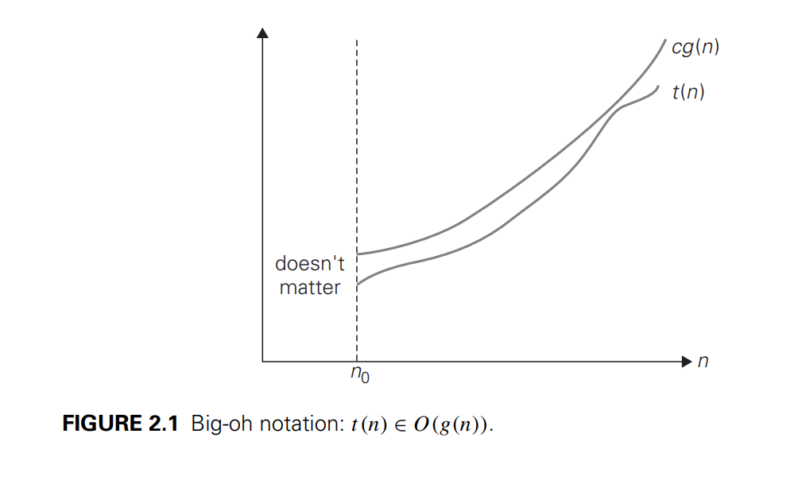

# Coding Notes
My personal notes on analysis and design framework for algorithms.

## Time Complexity
**Asymptotic Notations and Basic Efficiency Classes**
The efficiency analysis framework concentrates on the order of growth of an algorithm’s basic operation count as the
principal indicator of the algorithm’s efficiency. To compare and rank such orders
of growth, computer scientists use three notations: O (big oh),  oemga (big omega), and
 theta (big theta). In the following discussion, t (n) and
g(n) can be any nonnegative functions defined on the set of natural numbers. In
the context we are interested in, t (n) will be an algorithm’s running time (usually
indicated by its basic operation count C(n)), and g(n) will be some simple function
to compare the count with.

**O-notation**

A function t (n) is said to be in O(g(n)), denoted t (n) ∈ O(g(n)),
if t (n) is bounded above by some constant multiple of g(n) for all large n, i.e., if
there exist some positive constant c and some nonnegative integer n0 such that
```
t (n) ≤ cg(n) for all n ≥ n0.
```


**omega -notation**
A function t (n) is said to be in (g(n)), denoted t (n) ∈ (g(n)), if
t (n) is bounded below by some positive constant multiple of g(n) for all large n,
i.e., if there exist some positive constant c and some nonnegative integer n0 such
that
```
t (n) ≥ cg(n) for all n ≥ n0.
```


theta -notation
A function t (n) is said to be in (g(n)), denoted t (n) ∈ (g(n)),
if t (n) is bounded both above and below by some positive constant multiples of
g(n) for all large n, i.e., if there exist some positive constants c1 and c2 and some
nonnegative integer n0 such that
c2g(n) ≤ t (n) ≤ c1g(n) for all n ≥ n0.


**THEOREM** -
```
If t1(n) ∈ O(g1(n)) and t2(n) ∈ O(g2(n)), then
t1(n) + t2(n) ∈ O(max{g1(n), g2(n)}).
```

